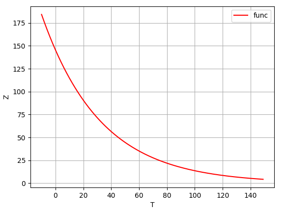

Программа принимает на вход калибровочные значения (файл _temp.csv_).

Программа выдаёт решение: **-0.0236806
4.98004**

Решение можно проверить построив график с помощью _matpltlib_:

Данный график показывает зависимость показаний датчика от температуры.
График позволяет получить значение температуры по показанию датчика.